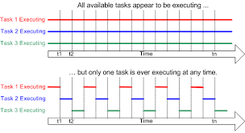

## 1. RTOS
### 1.1 RTOS is standard Real Time Operating System hay hệ điều hành thời gian thực được dùng trong các vi điều khiển để điều khiển thiết bị  một cách nhanh chóng và đa nhiệm (multi tasking).

#### Operating System: 
- Hệ điều hành là một tập hợp các chương trình được thiết kế để quản lý tất cả các tài nguyên của máy tính. Nói cách khác, một tập hợp các chương trình đóng vai trò trung gian giữa người dùng máy tính và phần cứng máy tính.

- Bộ nhớ, thiết bị I/O, thiết bị liên lạc, v.v. là tài nguyên phần cứng của máy tính. Hệ thống tệp, bộ nhớ ảo, bảo mật, v.v. là tài nguyên phần mềm. Bây giờ một tập hợp các chương trình được sử dụng để quản lý tất cả các tài nguyên này được gọi là hệ điều hành.

#### Shell
- Shell is the program that handles all other programs.( Shell là chương trình xử lý tất cả các chương trình khác)

##### For example:
- K- shell or Born shell in UNIX
- Explorer.exe in windows
- Command program in DOS

#### Kernel
- The kernel provides the most basic control over all of the computer’s hardware devices. Time management, task scheduling, memory management, file system, etc. all are monitored by the Kernel.
( Cung cấp khả năng kiểm soát cơ bản nhất đối với tất cả các thiết bị phần cứng của máy tính. Quản lý thời gian, lập lịch tác vụ, quản lý bộ nhớ, hệ thống tệp, v.v. đều được Kernel giám sát.)

### 1.2 Các đặc trưng của RTOS.
- High performance.
- Safety and security.
- Priority-based scheduling.
- Small.
### 1.3 Cách hoạt động của RTOS.
Điều phối các Task, lập lịch và phân mức ưu tiên cho Task (Cơ chế Multi-Tasking)

